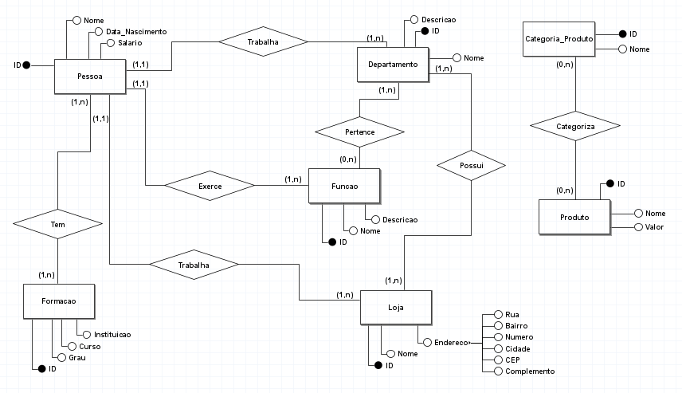
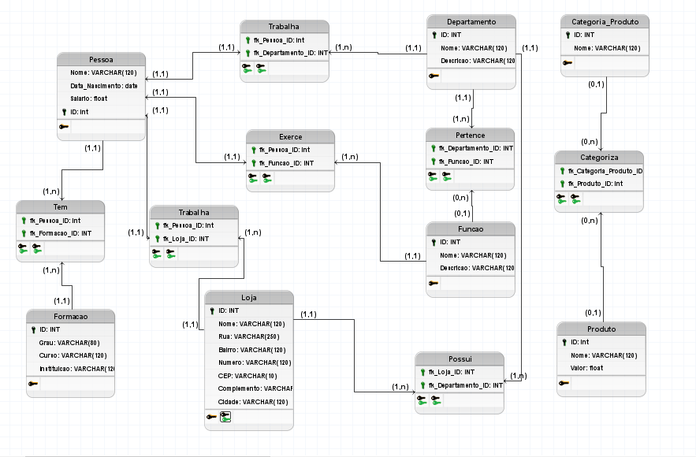

# fast_marketplace_challenge

## Minimundo Fast Market Place

A Fast_marketplace, é uma loja de venda de softwares, a plataforma armazena os dados dos funcionarios(nome, data de nascimento, salario e os dados da formação de cada um). Cada funcionario trabalha em um departamento e possui uma função, que serão detalhados no banco de dados com nome e descrição. Toda loja possui vários departamentos onde esses funcionários atuam.

Os produtos oferecidos são subdivididos em categorias.

## Modelo Conceitual

## Modelo Lógico

